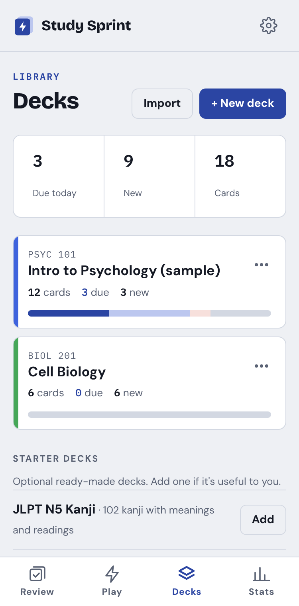
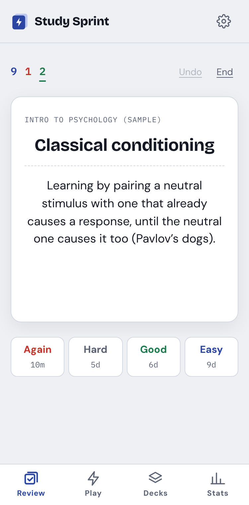
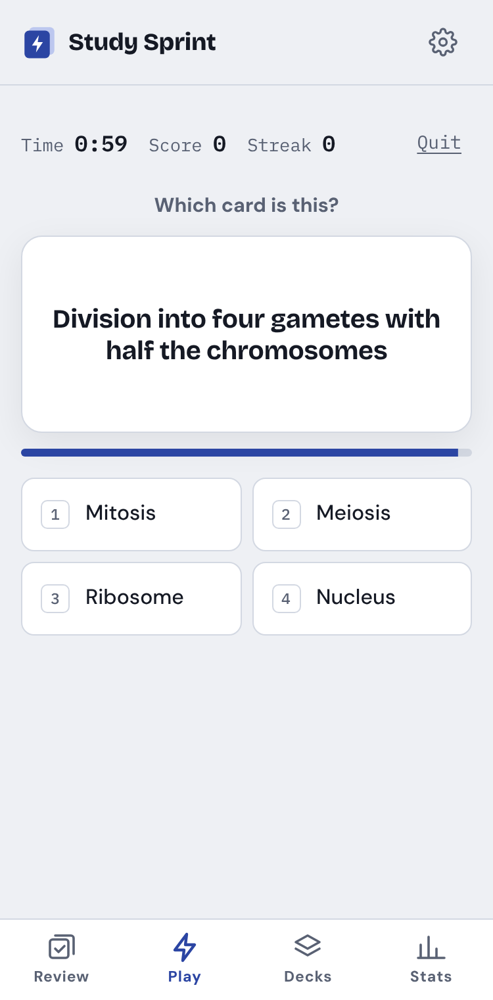
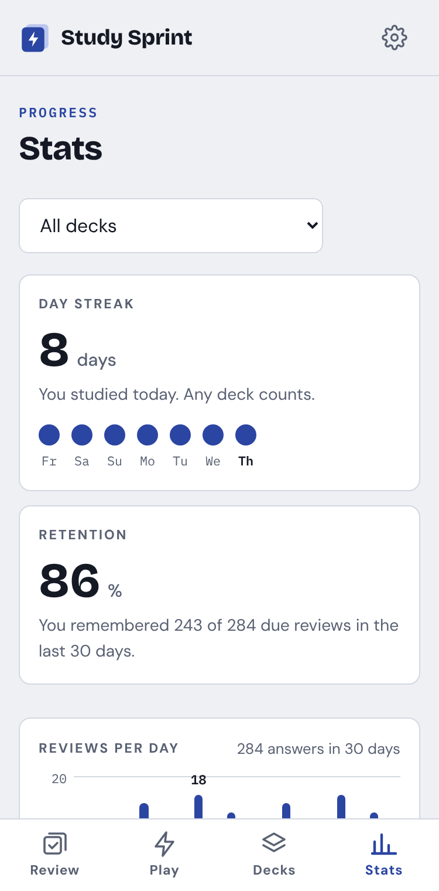

# Study Sprint ⚡

A mobile-first flashcard app for university courses. It combines real spaced repetition (FSRS-6, like modern Anki) with timed game rounds for cramming, and your game answers feed the review schedule automatically.

**Use it:** [aayan277.github.io/study-sprint](https://aayan277.github.io/study-sprint/)

<p>
  
  
  
  
</p>

## Features

- **Decks:** create, rename, recolor and delete decks. Each shows its cards, how many are due and new, and a mastery bar. A deck can have its own new-cards-per-day limit (Edit), inside the overall one.
- **Card list** (each deck's page, or Decks → Browse all cards):
  - Search, filter (new, learning, due, suspended, buried, flags, leeches) and sort (date added, due, most forgotten, hardest, A–Z).
  - Tap a card to edit it, suspend it, bury it until tomorrow, flag it, move it, reset it to new, set its due date, delete it, or see its full history (Card info).
  - Select several cards to do any of these to all of them at once, and add single cards with + Add card.
  - Suspended and buried cards are left out of Review and Play.
- **Import** (the fastest way in):
  - Paste notes in almost any format: `term - definition`, tabs, `|`, `:`, `=`, commas, numbered or bulleted lists, Notion and markdown tables, **bold** terms, Quizlet exports, or term and definition on separate lines. The format is detected for you.
  - Upload .csv, .tsv, .txt or Excel (.xlsx) files, or load a shared Google Sheet.
  - Check everything in an editable preview first: fix cells, delete rows, swap front and back, pick columns, and see duplicates flagged.
  - **Make cards with Claude** copies a ready-made prompt with your notes, to paste into Claude.
- **Review:** daily spaced repetition with FSRS-6.
  - Flip a card (tap or Space) or type the answer, then rate it Again / Hard / Good / Easy. Each button shows when the card comes back.
  - Undo, keyboard shortcuts (Space flip, 1–4 rate, E edit, I card info, - bury, @ suspend), and a summary at the end.
  - The ⋯ button opens the card's panel mid-review: edit, flag, suspend, bury, move, reset, set due date, delete or see its info.
  - **Custom study** (on the Review screen): add extra new cards for today, review ahead (cards due in the next day to 2 weeks), or go over the cards you forgot today.
  - **Leeches:** a card you forget 8 times (changeable in Settings) is tagged “leech” and suspended (or just tagged), like Anki.
  - Advanced scheduling in Settings: learning and relearning steps, a maximum interval (handy before exams) and fuzz on/off.
- **Play:** timed rounds.
  - **Classic** (10/20/40 questions), **Survival** (3 lives, shrinking timer) and **Lightning** (60 seconds).
  - Front → back, back → front, or typing. Definition-style decks start on back → front (read the definition, pick the term), and your own pick is remembered per deck.
  - **Hard** mode (6 lookalike options) and **Flash** (the question vanishes).
  - Streak scoring, an S–D grade and best scores.
  - **Card ⋯** after each answer opens the same card panel (pauses the round).
- **Auto-grading:** a Play answer on a due card counts as its review (fast, normal, slow or wrong becomes Easy, Good, Hard or Again). A miss on any studied card brings it back.
- **Stats:**
  - day streak and retention
  - reviews per day for 30 days, and cards due over the next 7 days
  - hardest cards, with a **Drill these** button
  - a mastery grid you can tap card by card
- **Backups:** export everything to one file and restore it on any device (Settings → Your data).
- **Starter decks:** optional JLPT N5 and N4 kanji decks (Decks tab → Starter decks).
- **Themes:** 6 color themes (Ink, Blossom, Sage, Cobalt, Neon, Onyx), most with light and dark versions.
- **Works offline,** installs on your phone, and keeps your data on your device.

## Install it on your phone

1. Open the link above in **Safari** (iPhone) or **Chrome** (Android).
2. iPhone: tap **Share → Add to Home Screen**. Android: tap **⋮ → Install app**.
3. It opens full screen from its own icon and works without internet.

On a computer, open the link in Chrome or Edge and use the install button in the address bar.

## Your data

Everything is saved in your browser (IndexedDB), on your device only. There are no accounts and no servers.

- The home-screen app and a browser tab can have **separate** storage (especially on iPhone), so pick one and stick with it.
- **Export a backup now and then** (Settings → Back up). To move to a new phone or computer, export there and choose **Import backup** on the new device.

## How it's built

Plain HTML, CSS and JavaScript modules. There's no build step, so GitHub Pages serves the files exactly as they are. Libraries come from a CDN at pinned versions: [ts-fsrs](https://github.com/open-spaced-repetition/ts-fsrs) 5.4.2 for scheduling, and SheetJS, loaded only when you import an Excel file.

| File | What it does |
| --- | --- |
| `index.html` | Page frame: header, screen area, bottom tab bar |
| `css/styles.css` | All styles. The theme colors are at the top |
| `js/app.js` | Starts the app, switches screens, Settings and backups |
| `js/db.js` | Saving and loading (IndexedDB), backup export and restore |
| `js/decks.js` | Deck list, deck page, create/edit/delete, starter decks |
| `js/browse.js`, `js/browse-logic.js` | The card list: search, filters, sorting, and every card action |
| `js/import.js` | Format detection for pasted text, files and sheets |
| `js/import-screen.js` | The Import screen and its preview |
| `js/review.js` | The Review screen |
| `js/srs.js` | FSRS-6 scheduling (wraps ts-fsrs) |
| `js/sched-settings.js` | Checking and applying the advanced scheduling settings |
| `js/queue.js`, `js/days.js` | Which cards are due today (a study day starts at 4am) |
| `js/match.js` | Checking typed answers (typos, alternates, articles, spaces) |
| `js/play.js` | The Play screen |
| `js/game.js` | Game rules: scoring, timers, wrong-answer options |
| `js/autograde.js` | Turning Play answers into review ratings |
| `js/stats.js`, `js/stats-calc.js` | The Stats screen and the numbers behind it |
| `js/jlpt.js` | The optional JLPT kanji starter decks |
| `js/themes.js`, `js/sample.js`, `js/ui.js` | Themes, the sample deck, shared helpers |
| `tests/*.test.js` | Tests for every rule above that doesn't need a browser |
| `sw.js`, `manifest.webmanifest`, `icons/` | Offline support and installing as an app |

The full plan, including what's planned next, is in [PLAN.md](PLAN.md).

## Running it on your computer

ES modules don't load from a `file://` address, so use a tiny local server:

```
npx http-server -c-1
```

Then open the address it prints.

## Running the tests

```
node --test
```

To run one file, use for example `node tests/import.test.js`. No install is needed: it uses Node's built-in test runner. `package.json` only tells Node the files are modules.
